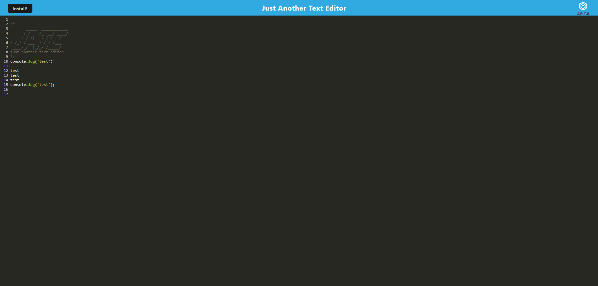

  # PWAchallenge README.md

  ## Description

  This project allows users to write text in a editor and have this text remain after leaving or going offline

  ## Table Of Contents 

  * [Installation](#Installation)

  * [Usage](#usage)

  * [Contributing](#contributing)

  * [Tests](#tests)

  * [Questions](#questions)

  ## Installation

  To install necessary dependencies, run the following command:

  npm i

  ## Usage

  The use of this project is to not allow the user to lose anything they have written on the page

  ## Contributing 

  send a pull request

  ## Tests

  To run tests run the following command:

  no test

  ## Questions

  if you have any questions about the repo, Please feel free to open a issue or contact me directly at terrencemccarthycode@gmail.com
  You can find more of my work at https://github.com/Tmysterz

  ## Deployed Application

  [PWAchallenge]()

  ## Github 

  [Github]()

  ## Screenshot

  